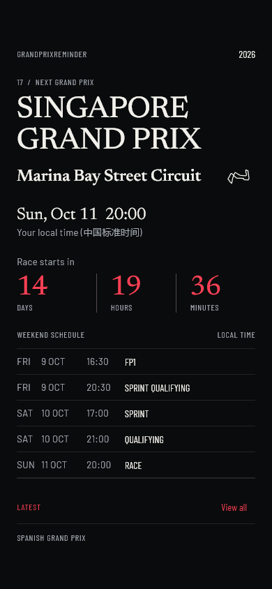
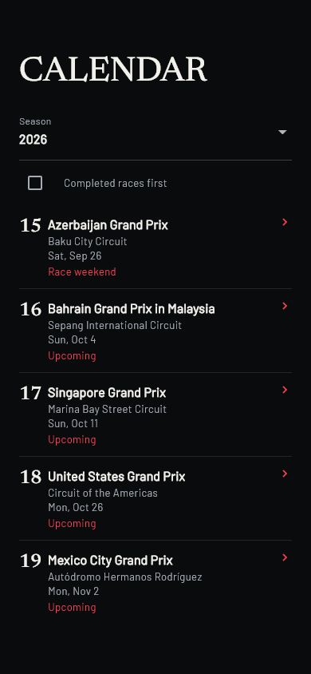
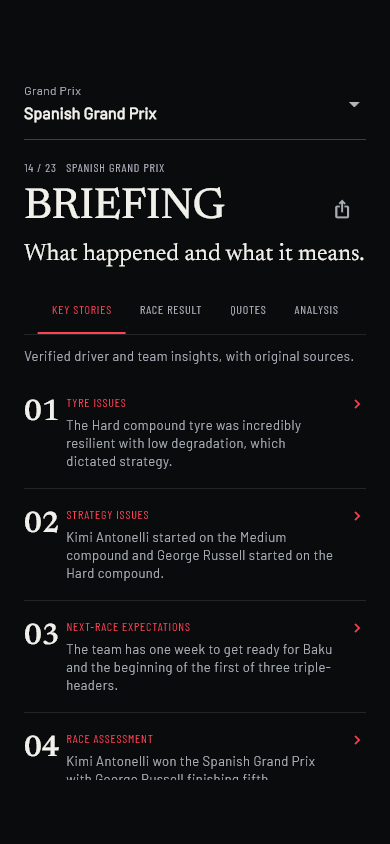
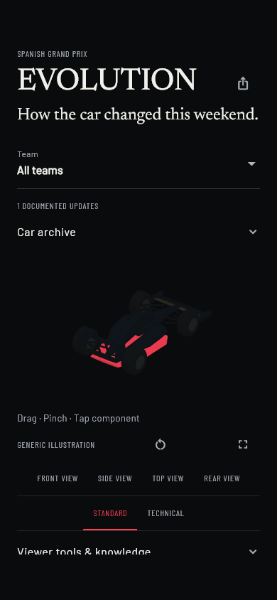
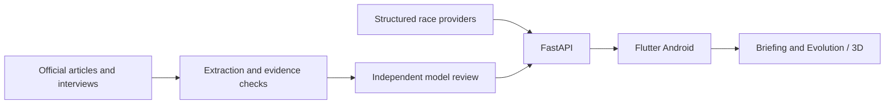

# GrandPrixReminder

From the next lights out to the story behind the upgrades.

**Android · Release 1.1 · 1.1.0+2** · [简体中文](README.zh-CN.md)

An independent F1 weekend companion for schedules, results, local reminders, source-linked Briefing and Evolution with an interactive 3D technical illustration.

## Install

Signed APK: `GrandPrixReminder-v1.1.0.apk`, built into `mobile/build/release-candidate/`. See the [1.1 release notes](docs/release-notes-v1.1.0.md) for publication status and validation limits. Published versions are listed under [GitHub Releases](https://github.com/hfdsdfgr/grand-prix-reminder/releases).

The existing release signing key is retained and the version code increases from 1 to 2. Releases with the same signature support an in-place update. Debug builds have a different signature; uninstalling clears local preferences.

## Interface

These captures render the current Flutter pages using previously recorded real API payloads. They are page-level regression screenshots, not a live production or physical-device acceptance run. The Evolution capture uses the test rendering path and does not demonstrate GPU 3D rendering.

| Home | Calendar | Briefing | Evolution |
| :---: | :---: | :---: | :---: |
|  |  |  |  |

[Home actions](docs/screenshots/v1.1/home-actions-en.png) · [GP Detail](docs/screenshots/v1.1/detail-en.png) · [Settings](docs/screenshots/v1.1/settings-en.png) · [Capture notes](docs/screenshots/README.md)

## New in 1.1

- **Editorial UI:** typography, spacing and dividers organize each page. Home uses simple detail and reminder rows with actual configuration and permission status.
- **Compact Calendar:** upcoming races first by default, with a completed-first option. Full results, fastest laps and lap counts live in GP Detail.
- **Team Identity:** a consistent thin color marker with readable abbreviations or names for all 11 teams in 2026, without official team logos or new network assets.
- **Evolution stability:** fixes scroll-offset and expansion-state restoration conflicts, aligns both locales and adds lightweight 3D interaction hints.

## Weekend tools

- Local session times, next-race countdown, weekend schedule, circuit layouts and structured results.
- Local reminders, spoiler-free reading, driver/team follows and persistent English / Simplified Chinese selection.
- Briefing stories, results, quotes and analysis with traceable original sources.
- Evolution lifecycle, Timeline, Standard / Technical, five views, Exploded, Ghost Compare and component sources.
- Explicit network-error, stale-cache, empty-data and low-confidence states.

## Data and evidence

Schedules and results come from structured providers. Briefing and Evolution retain official-source discovery, extraction, evidence checks and independent model review. Unsupported Purpose, Analysis or Quote fields stay Unknown or hidden. Both locales share factual and evidence IDs. Model review cannot guarantee technical correctness.

The shared 3D car is a technical illustration, not a team-specific CAD reconstruction. Distinct geometry requires verified model assets. A race without qualifying sources can legitimately have no Evolution updates.



## Development and documentation

```powershell
cd mobile
flutter pub get
flutter analyze
flutter test
cd ..
./scripts/build-release.ps1
```

- [Developer guide](docs/getting-started.md) · [Mobile setup and signing](mobile/README.md)
- [Release 1.1](docs/release-notes-v1.1.0.md) · [Changelog](CHANGELOG.md)
- [Team identity and RGB sources](docs/team-identity.md) · [UI specification](UI_V2_SPEC.md)
- [Data architecture](DATA_ARCHITECTURE.md) · [Evolution](docs/evolution.md) · [Reminders](docs/reminders.md)

## Current limits and attribution

The production API still uses unencrypted public HTTP. Connections to that endpoint timed out during this release preparation; the signed build retains the existing address. Online availability needs revalidation once connectivity returns.

Circuit SVGs are adapted from [F1DB under CC BY 4.0](mobile/assets/circuits/ATTRIBUTION.md). Team-color sources and adjustments are documented in [Team Identity](docs/team-identity.md). F1, team and circuit names belong to their owners; this is an independent project. No project-wide open-source license is declared.
