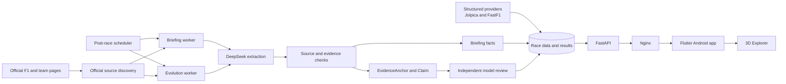
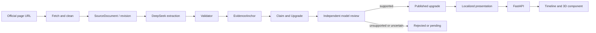

# GrandPrixReminder

### Race. Debrief. Evolution.

An Android companion for the F1 race weekend: know when the next race starts, read source-linked post-race briefings, and explore a team's published technical upgrades.

**Android · v1.0.0** · [简体中文](README.zh-CN.md)

## Download

[Download the v1.0.0 APK](https://github.com/hfdsdfgr/grand-prix-reminder/releases/download/v1.0.0/GrandPrixReminder-v1.0.0.apk) · [Release notes](docs/release-notes-v1.0.0.md)

## Product Preview

These are screenshots from the running Android app. The 3D car is a technical illustration, with team-inspired colors rather than an official livery.

| Home | Races | Briefing | 3D Explorer |
| :---: | :---: | :---: | :---: |
|  |  |  |  |

The gallery covers Home, Races, Briefing and the 3D Explorer. A separate Evolution upgrade-timeline screenshot remains on the [screenshot checklist](docs/screenshots/README.md).

## Features

- **Race weekend:** next Grand Prix, local start time, countdown, sessions, calendar, circuit layout and structured results.
- **Reminders:** local notifications with 24-hour, 1-hour, 15-minute and custom lead times, subject to Android notification permissions.
- **Personal controls:** spoiler-free results, local driver/team follows, and persistent English / Simplified Chinese selection.
- **Resilient reading:** loading, empty and error states; cached race data is marked stale when appropriate.

## Briefing

Post-race Briefing organizes sourced driver and team information by topic, including strategy, tyres, incidents and future expectations when evidence is available. Each item retains a path to its original source. Structured race results come from data providers; language models process article and interview text, not race classification.

## Evolution / 3D Explorer

Evolution connects published upgrades to a team, race, component, lifecycle and original evidence. Select a car to read its season timeline, then select a component to inspect a linked upgrade. The viewer supports rotation, zoom, preset angles, exploded and technical views. Comparison controls use available race specifications; distinct 3D geometry is shown only when verified model assets exist.

The current shared car geometry is an **illustration**, not a CAD reconstruction of each team's car. Team car names and official links identify the real car; colors are visual cues, not official liveries. Lower-confidence published claims carry a notice, and the source remains available for inspection.

## Architecture

Race times, calendar and results follow structured-provider paths. Article-derived Briefing and Evolution use the post-race processing path.

The Evolution evidence path keeps factual identity separate from presentation language:

Model review reduces unsupported publication; it does not establish absolute technical correctness. Evidence and business entity IDs stay stable across English and Chinese presentation.

## Getting Started

Install the [signed APK](https://github.com/hfdsdfgr/grand-prix-reminder/releases/download/v1.0.0/GrandPrixReminder-v1.0.0.apk) on Android. Android can update an installed release build signed with the same key; a Debug-signed build uses a different key. Uninstalling the existing app removes local follows, language and reminder preferences.

For local Backend, Flutter, tests and release-build commands, see the [developer guide](docs/getting-started.md). The app's environment and signing notes are in [mobile/README.md](mobile/README.md).

## Documentation

- [Developer guide and API routes](docs/getting-started.md)
- [Release notes](docs/release-notes-v1.0.0.md) · [Changelog](CHANGELOG.md)
- [Data architecture](DATA_ARCHITECTURE.md) · [Evolution implementation](docs/evolution.md) · [Reminders](docs/reminders.md)
- [Circuit SVG attribution](mobile/assets/circuits/ATTRIBUTION.md) · [Screenshot checklist](docs/screenshots/README.md)

## Data Sources & Known Limitations

- v1.0 connects to the ECS API over **unencrypted HTTP on a public IP**. HTTPS and a domain are future deployment work.
- Evolution's automated evidence check and independent model review can still misclassify a technical claim. Inspect linked original sources, especially on lower-confidence entries.
- Some races have no qualifying official technical source; an empty Evolution state is a valid outcome. Historical coverage does not guarantee future coverage.
- The circuit SVGs are adapted from [F1DB under CC BY 4.0](mobile/assets/circuits/ATTRIBUTION.md). The shared 3D illustration is generated from this repository's prototype. F1, team and circuit names remain their owners' trademarks; this is an independent project.
- This repository has no project-wide open-source license declared. Third-party asset attribution does not license the whole project.
