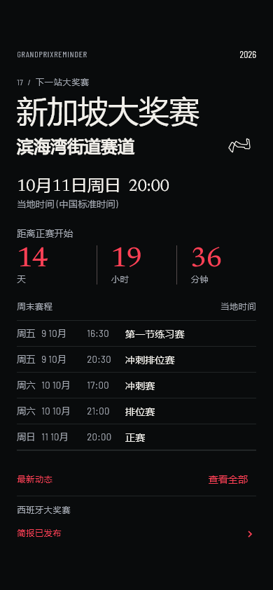
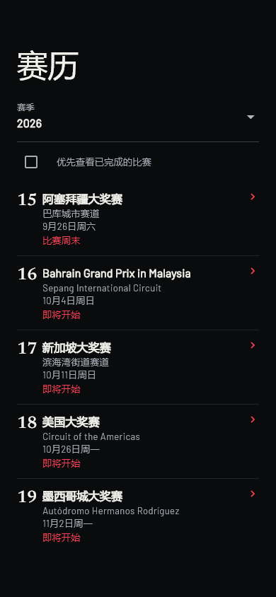
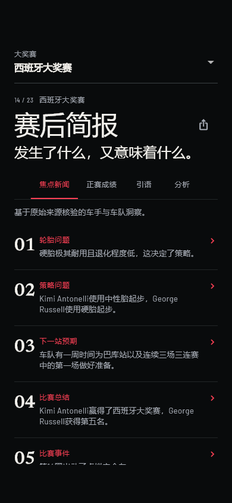
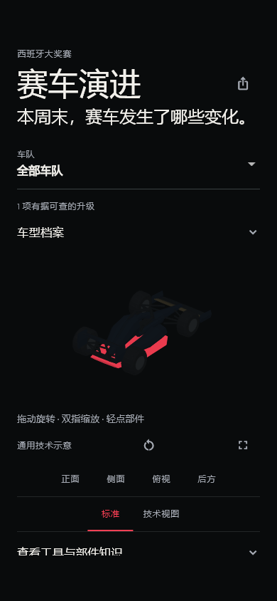
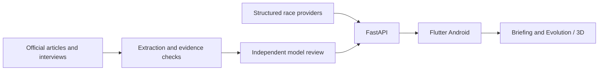

# GrandPrixReminder

比赛周末，从下一场发车到赛后技术演进。

**Android · Release 1.1 · 1.1.0+2** · [English](README.md)

一款独立 F1 周末伴侣：查看赛程与成绩，设置本地提醒，阅读可追溯来源的 Briefing，并探索 Evolution 与 3D 技术示意。

## 安装

正式签名 APK：`GrandPrixReminder-v1.1.0.apk`。本地构建产物位于 `mobile/build/release-candidate/`，发布状态与验证限制见 [1.1 发布说明](docs/release-notes-v1.1.0.md)。[GitHub Releases](https://github.com/hfdsdfgr/grand-prix-reminder/releases) 提供已公开发布的版本。

沿用既有 release 签名，版本码从 1 升至 2；同签名旧正式版支持覆盖更新。Debug 版签名不同，卸载会清除本地设置。

## 界面

下图由本版 Flutter 页面渲染并截取，使用仓库中此前捕获的真实 API payload。它们是页面级回归截图，不是本次在线生产验收或真机截图；Evolution 图使用测试渲染路径，不代表 GPU 3D 效果。

| Home | Calendar | Briefing | Evolution |
| :---: | :---: | :---: | :---: |
|  |  |  |  |

[Home actions](docs/screenshots/v1.1/home-actions-zh-CN.png) · [GP Detail](docs/screenshots/v1.1/detail-zh-CN.png) · [Settings](docs/screenshots/v1.1/settings-zh-CN.png) · [Capture notes](docs/screenshots/README.md)

## 1.1 更新

- **统一 editorial UI**：以文字层级、留白和分隔线组织信息。Home 下半部分采用详情入口行与提醒设置行，显示实际提醒配置和权限状态。
- **紧凑 Calendar**：默认未完成赛事优先，可切换已完成赛事优先；完整结果、最快圈和圈数在 GP Detail 查看。
- **Team Identity**：统一细竖色条搭配缩写或名称，覆盖 2026 年 11 支车队；无官方车队 Logo、图片或新增网络资产。
- **Evolution 稳定性**：修复滚动位置与展开状态恢复冲突；中英文共享组件结构，增加轻量 3D 操作提示。

## 比赛周末功能

- 本地时间、下一场倒计时、完整周末场次、赛道图和结构化成绩。
- 本地提醒、无剧透、车手与车队关注，以及持久化中英文选择。
- Briefing 的关键故事、成绩、引述与分析；原始来源始终可追溯。
- Evolution lifecycle、Timeline、Standard / Technical、五个视角、Exploded、Ghost Compare 与部件来源。
- 网络失败、缓存过期、空数据和低置信度均有明确状态。

## 数据与证据

赛程与成绩来自结构化数据源；Briefing 与 Evolution 沿用官方来源发现、提取、证据校验与独立模型复核流程。无法支持的 Purpose、Analysis 或 Quote 保持 Unknown 或隐藏，中英文沿用同一事实与证据 ID。模型复核不能保证结论绝对正确。

3D 共用模型是技术示意，不是各车队 CAD 重建；只有存在经过验证的模型资产时，才能呈现真实几何差异。没有合格来源的比赛可以没有 Evolution 内容。



## 开发与文档

```powershell
cd mobile
flutter pub get
flutter analyze
flutter test
cd ..
./scripts/build-release.ps1
```

- [Developer guide](docs/getting-started.md) · [Mobile setup and signing](mobile/README.md)
- [Release 1.1](docs/release-notes-v1.1.0.md) · [Changelog](CHANGELOG.md)
- [Team identity and RGB sources](docs/team-identity.md) · [UI specification](UI_V2_SPEC.md)
- [Data architecture](DATA_ARCHITECTURE.md) · [Evolution](docs/evolution.md) · [Reminders](docs/reminders.md)

## 当前限制与署名

生产 API 仍使用公网 HTTP，通信未加密。本次发布准备期间该地址连接超时，正式包保留原地址；线上可用性待恢复后复验。

赛道 SVG 改编自 [F1DB，CC BY 4.0](mobile/assets/circuits/ATTRIBUTION.md)。车队颜色来源及调整集中记录于 [Team Identity](docs/team-identity.md)。F1、车队与赛道名称属于各权利人；本项目为独立项目。仓库尚未声明项目整体开源许可证。
