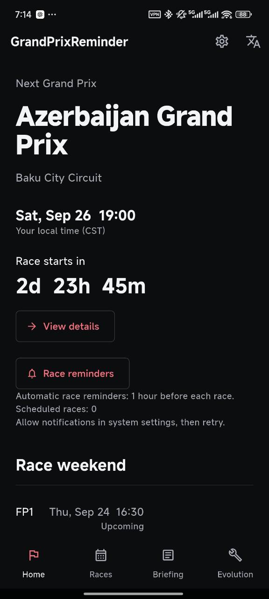
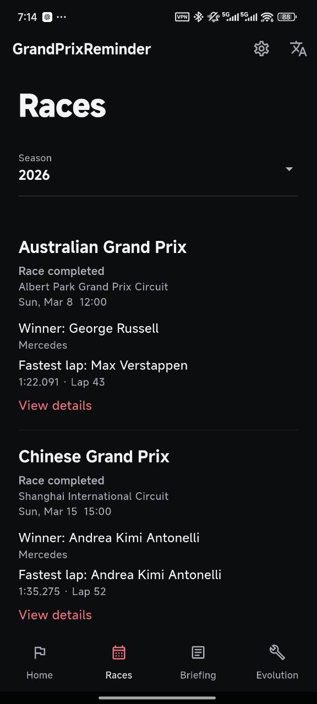
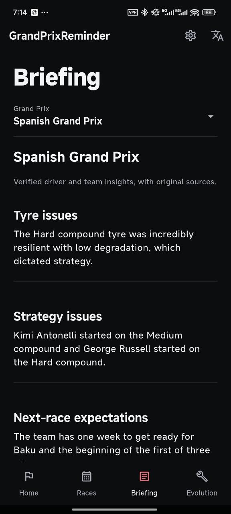
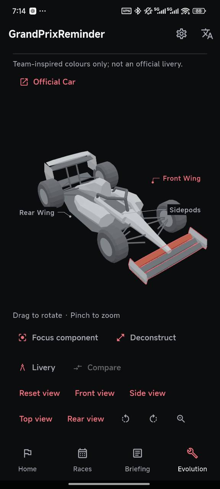
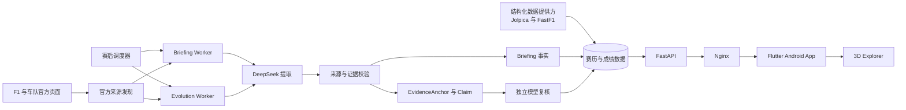
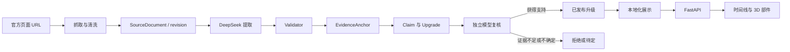

# GrandPrixReminder

### Race. Debrief. Evolution.

一款面向 F1 比赛周末的 Android 助手：查看下一场比赛时间，阅读带原始来源的赛后 Briefing，并探索车队已发布的技术升级。

**Android · v1.0.0** · [English](README.md)

## 下载

[下载 v1.0.0 APK](https://github.com/hfdsdfgr/grand-prix-reminder/releases/download/v1.0.0/GrandPrixReminder-v1.0.0.apk) · [发布说明](docs/release-notes-v1.0.0.md)

## 产品预览

以下均为运行中的 Android App 实拍截图。3D 赛车是技术示意，车队风格配色并非官方涂装。

| 首页 | 赛历 | Briefing | 3D Explorer |
| :---: | :---: | :---: | :---: |
|  |  |  |  |

现有四张截图覆盖首页、赛历、Briefing 和 3D Explorer。Evolution 升级时间线的单独截图列在[截图清单](docs/screenshots/README.md)中。

## 功能

- **比赛周末：**下一场大奖赛、本地开赛时间、倒计时、场次、赛历、赛道轮廓与结构化成绩。
- **提醒：**支持提前 24 小时、1 小时、15 分钟及自定义时间的本地通知，实际投递取决于 Android 通知权限。
- **个人设置：**无剧透结果、本地关注车手与车队、简体中文 / English 切换及持久化设置。
- **稳定阅读：**加载、空内容、错误状态；缓存赛历在适用时标记为过期。

## Briefing

赛后 Briefing 按策略、轮胎、事故与未来展望等主题整理具有来源支持的车手和车队信息；仅在有证据时展示对应内容。每条内容保留原始来源。比赛成绩由结构化数据提供方提供；语言模型处理报道与采访文本，不生成比赛名次。

## Evolution / 3D Explorer

Evolution 将已发布升级关联到车队、比赛、部件、生命周期与原始证据。选择赛车可查看该赛季升级时间线，选择部件可查看对应升级。查看器支持旋转、缩放、预设视角、爆炸与技术视图。比较功能使用已有比赛规格；只有具备经过验证的独立模型资产时才展示不同的 3D 几何。

当前共用赛车几何属于**技术示意**，不是各车队赛车的 CAD 复刻。车型名称和官方链接指向真实车型；配色仅用于辅助识别。低置信度已发布主张会显示提示，原始来源仍可查看。

## 架构

比赛时间、赛历与成绩走结构化数据链路。来自报道的 Briefing 与 Evolution 走赛后处理链路。

Evolution 证据链将事实身份与展示语言分离：

模型复核有助于减少缺乏证据的发布，但不能保证技术结论绝对正确。中英文展示沿用相同证据与业务实体 ID。

## 开始使用

在 Android 手机上安装[已签名 APK](https://github.com/hfdsdfgr/grand-prix-reminder/releases/download/v1.0.0/GrandPrixReminder-v1.0.0.apk)。同一签名的 release 版本可尝试覆盖更新；Debug 版本使用不同签名。卸载旧应用会移除本机关注、语言和提醒设置。

本地 Backend、Flutter、测试和 release 构建命令见[开发指南](docs/getting-started.md)。环境与签名说明见 [mobile/README.md](mobile/README.md)。

## 文档

- [开发指南与 API 路径](docs/getting-started.md)
- [发布说明](docs/release-notes-v1.0.0.md) · [更新记录](CHANGELOG.md)
- [数据架构](DATA_ARCHITECTURE.md) · [Evolution 实现](docs/evolution.md) · [赛事提醒](docs/reminders.md)
- [赛道 SVG 授权说明](mobile/assets/circuits/ATTRIBUTION.md) · [截图清单](docs/screenshots/README.md)

## 数据来源与已知限制

- v1.0 使用公网 IP 上的 **HTTP 明文 API**；HTTPS 与域名属于后续部署工作。
- Evolution 的自动证据校验和独立模型复核仍可能误判技术主张。低置信度内容尤其值得打开原始来源核对。
- 部分比赛缺少合格官方技术来源，Evolution 为空属于正常状态。历史覆盖率不能保证未来比赛均有内容。
- 赛道 SVG 改编自 [F1DB，遵循 CC BY 4.0](mobile/assets/circuits/ATTRIBUTION.md)。共用 3D 技术示意由仓库原型生成。F1、车队与赛道名称属于各权利人；本项目为独立项目。
- 仓库目前未声明项目整体的开源许可证；第三方资产署名并不等于整个项目已获相同许可。
